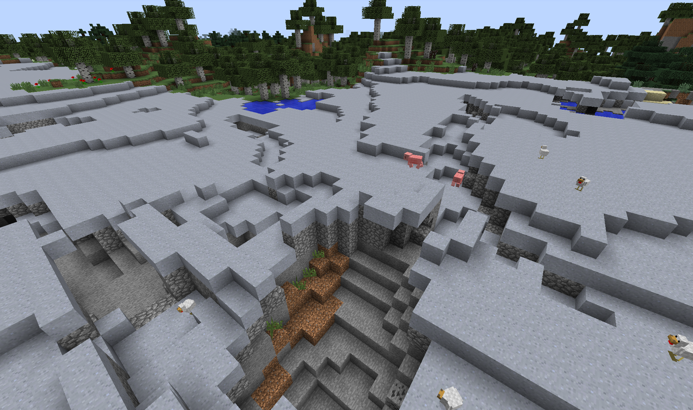
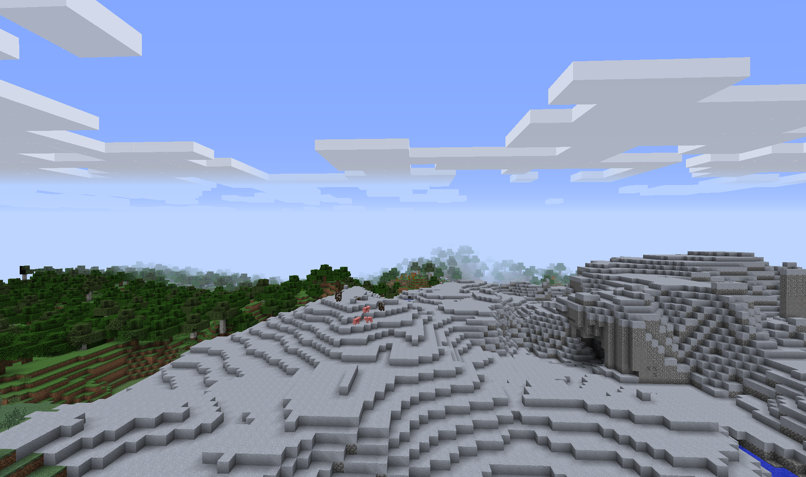
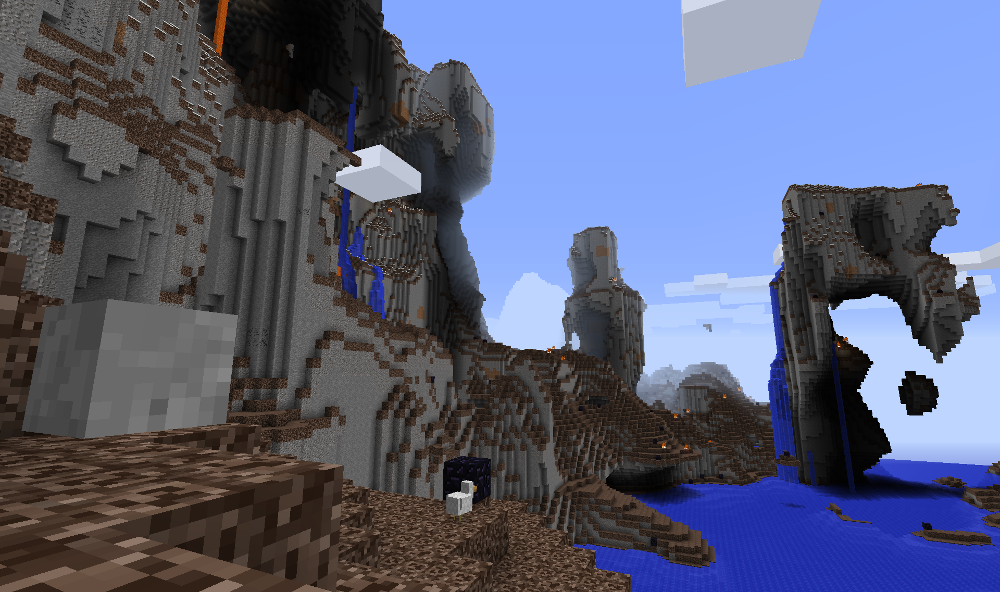
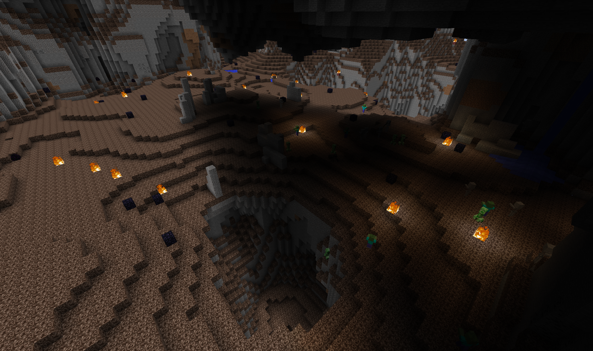
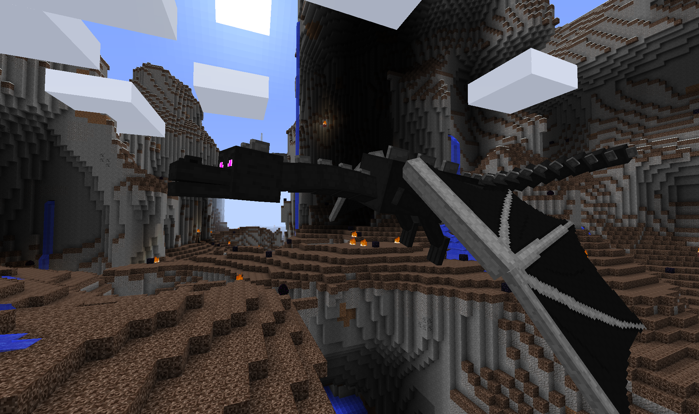

# Creating biomes

Biomes are regions in Minecraft that have various geographical features, heights, temperatures, and much more. Minecraft
generates the world with general temperature regions to prevent certain biomes being created next to each other (such 
as Ice Plains next to a Desert). When creating our custom biomes, we have to pick one of the four available categories: 
Desert, Warm, Cool, and Icy.

We'll start by creating a simple clay plains biome. Create a new Java class for our biome generation code.

```java
package com.example.coppermod;

import net.minecraft.block.Block;
import net.minecraft.init.Blocks;
import net.minecraft.world.World;
import net.minecraft.world.biome.BiomeGenPlains;

import java.util.Random;

public class BiomeGenClayPlains extends BiomeGenPlains {
    public BiomeGenClayPlains(int id) {
        super(id);
        this.setBiomeName("Clay Plains");
    }

    @Override
    public void genTerrainBlocks(World p_150573_1_, Random p_150573_2_, Block[] p_150573_3_, byte[] p_150573_4_,
                                 int p_150573_5_, int p_150573_6_, double p_150573_7_) {
        this.topBlock = Blocks.clay;
        this.fillerBlock = Blocks.cobblestone;

        this.genBiomeTerrain(p_150573_1_, p_150573_2_, p_150573_3_, p_150573_4_, p_150573_5_, p_150573_6_, p_150573_7_);
    }
}
```

We will get into setting the properties of our biome later. For now, we will register our biome generator with
Minecraft. First add the following method to our main mod class (ExampleMod / CopperMod).

```java
public int getFreeBiomeId(){
    int id = 0;
    id += BiomeManager.getBiomes(BiomeManager.BiomeType.COOL).size();
    id += BiomeManager.getBiomes(BiomeManager.BiomeType.DESERT).size();
    id += BiomeManager.getBiomes(BiomeManager.BiomeType.ICY).size();
    id += BiomeManager.getBiomes(BiomeManager.BiomeType.WARM).size();

    return id + 1;
}
```

Next, we can now register our biome with Minecraft. We can put this code with all of our other block/item
registration code.

```java
int clayBiomeCoolId = getFreeBiomeId();
int clayBiomeCoolProbability = 10;
BiomeManager.addBiome(BiomeManager.BiomeType.COOL, new BiomeManager.BiomeEntry(
        new BiomeGenClayPlains(clayBiomeCoolId), clayBiomeCoolProbability));

int clayBiomeWarmId = getFreeBiomeId();
int clayBiomeWarmProbability = 15;
BiomeManager.addBiome(BiomeManager.BiomeType.WARM, new BiomeManager.BiomeEntry(
        new BiomeGenClayPlains(clayBiomeWarmId), clayBiomeWarmProbability));
```

The `clayBiomeCoolProbability` and `clayBiomeWarmProbability` sets how often we will see our biome generate. The default
value for most of the Minecraft biomes is 10.

Now go explore and find the clay biome! If you cannot find it, you can increase the probability factor or register the
biome under different biome types.



## Biome Properties

The first major way we set our biome properties is by extending one of the Minecraft biome generators. We used the
plains biome generator, but there are others available. Here is our clay biome with the hills biome generator.



To find the available generators, you can open "External Libraries" -> "forgeSrc-1.7.10" -> "net" -> "minecraft" ->
"world" -> "biome" in our project window to find the available generators.

We will create a sample dragon lair biome with occasionally spawning Ender Dragons to demonstrate some of the available 
properties. Here is the code for the biome.

```java
package com.example.coppermod;

import net.minecraft.block.Block;
import net.minecraft.entity.boss.EntityDragon;
import net.minecraft.init.Blocks;
import net.minecraft.world.World;
import net.minecraft.world.biome.BiomeGenHills;

import java.util.Random;

public class BiomeGenDragonsLair extends BiomeGenHills {
    public BiomeGenDragonsLair(int id) {
        super(id, false);
        this.setBiomeName("Dragon's Lair");
        // Default values for the root height and variation in hills generator are 1.0F, and 0.5F respectively.
        Height biomeHeight = new Height(-0.2f, 2.5f);

        this.rootHeight = biomeHeight.rootHeight;
        this.heightVariation = biomeHeight.variation;
        
        // SpawnListEntry parameters: entity class, probability, min group size, max group size.
        // Default values for probability for Zombies are 100 and 12 for sheep.
        this.spawnableMonsterList.add(new SpawnListEntry(EntityDragon.class, 1, 1, 1));
    }

    @Override
    public void decorate(World world, Random random, int chunkX, int chunkZ) {
        this.theBiomeDecorator.decorateChunk(world, random, this, chunkX, chunkZ);

        // The higher the frequency, the more common our biome features will be generated.
        int frequency = 250;

        for (int l = 0; l < frequency; ++l)
        {
            // Pick a random x, y, z coordinate and place our biome decoration.
            int x = chunkX + random.nextInt(16);
            int y = 20 + random.nextInt(128);
            int z = chunkZ + random.nextInt(16);

            // Set our biome decorations only on top of our
            if (world.getBlock(x, y - 1, z) == this.topBlock)
            {
                // Spawn dragon eggs 5% of the time
                if((l % 20) == 0){
                    world.setBlock(x, y, z, Blocks.dragon_egg);
                }
                // Skeleton skulls 10%
                else if((l % 10) == 0){
                    world.setBlock(x, y, z, Blocks.skull);
                }
                // Fire 33%
                else if((l % 3) == 0){
                    world.setBlock(x, y, z, Blocks.fire);
                    world.setBlock(x, y - 1, z, Blocks.netherrack);
                }
                // Otherwise spawn obsidian blocks
                else{
                    world.setBlock(x, y, z, Blocks.obsidian);
                }

            }
        }
    }

    @Override
    public void genTerrainBlocks(World p_150573_1_, Random p_150573_2_, Block[] p_150573_3_, byte[] p_150573_4_,
                                 int p_150573_5_, int p_150573_6_, double p_150573_7_) {
        this.topBlock = Blocks.soul_sand;
        this.fillerBlock = Blocks.gravel;

        this.genBiomeTerrain(p_150573_1_, p_150573_2_, p_150573_3_, p_150573_4_, p_150573_5_, p_150573_6_, p_150573_7_);
    }
}
```

Some of the main properties are as follows:
* `this.topBlock` sets the top layer block of the biome. Only one block deep.
* `this.fillerBlock` sets the middle layer block before the stone and ore generation. Usually 1-3 blocks deep.
* `this.rootHeight` sets the median height the biome will be generated. Values between -2 and 2 loosely correspond to
y=0 and y=128.
* `this.heightVariation` sets the height variation of the biome. Lower vales result in flatter terrain and high values
result in steep peaks and trenches.
* `this.spawnableMonsterList` allows to add or remove spawnable entities for the biome. Also other lists such as for the
creatures
* Biome decorator: The method `decorate` allows us to program our custom terrain generation code.


Here is what our code will generate.






